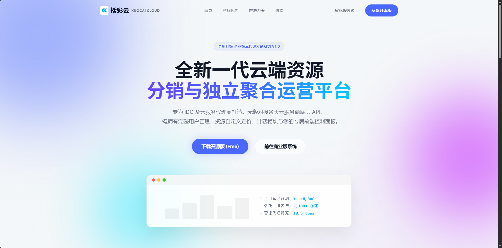
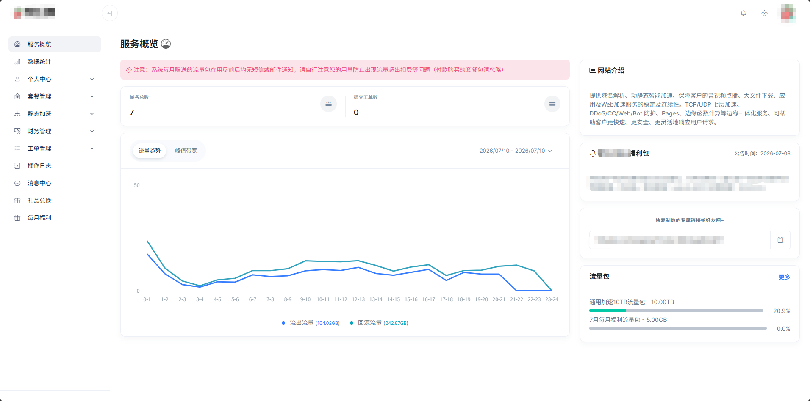
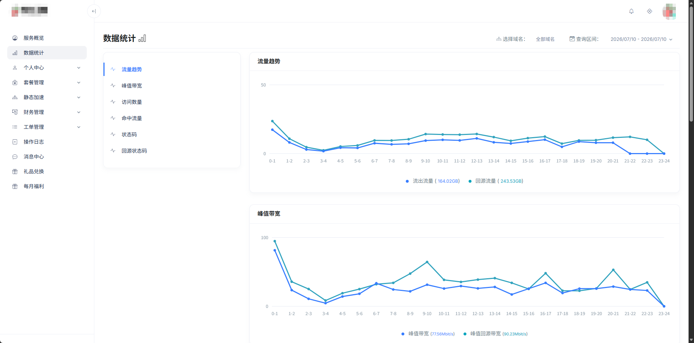
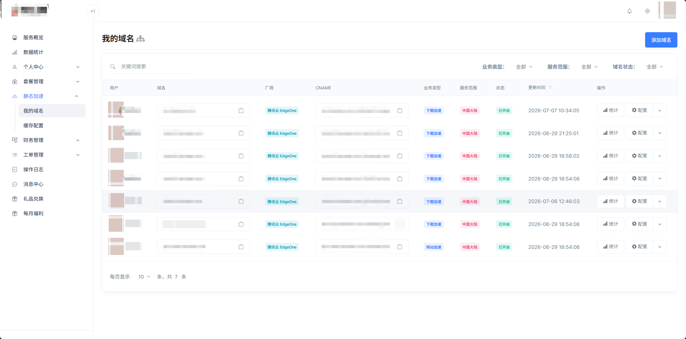
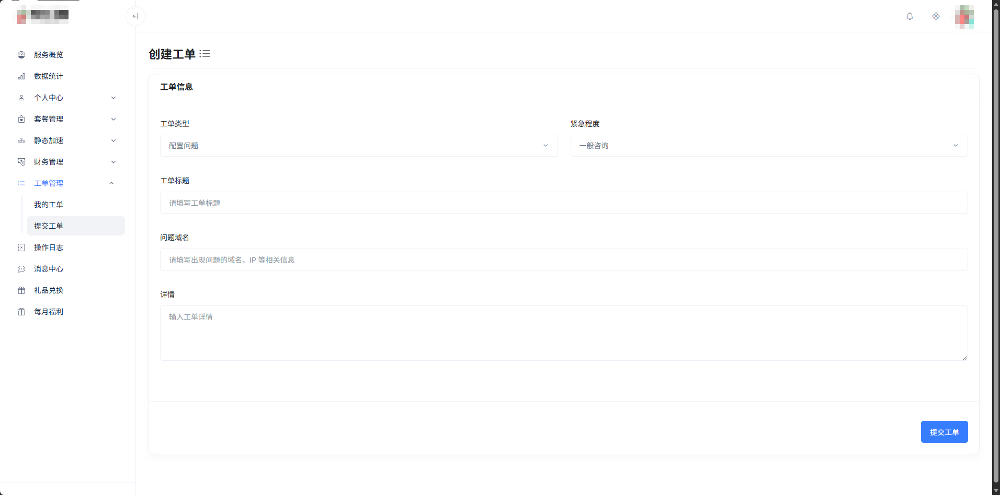
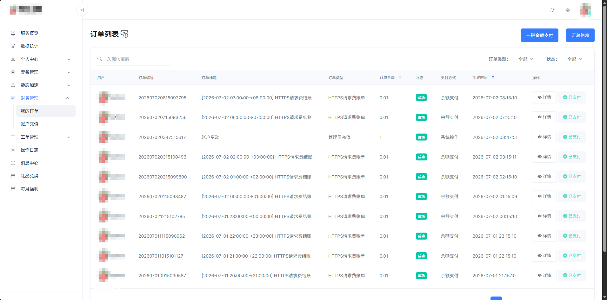

# KuocaiCDN Open Source Edition / 括彩 CDN 开源版

KuocaiCDN Open Source Edition is a Spring Boot based CDN management platform for teams that need to manage CDN domains, vendor accounts, certificates, origin settings, cache rules, traffic statistics, and balance-based usage billing in one self-hosted system.

括彩 CDN 开源版是一套基于 Spring Boot 的 CDN 管理系统，适合需要自建 CDN 管理平台的企业、服务商和技术团队使用。系统可用于统一管理 CDN 域名、厂商账号、证书、源站配置、缓存规则、流量统计和余额计费。

当前版本：`K2.1.3.0`，详细变更见 [CHANGELOG.md](CHANGELOG.md)。

## 界面截图 / Screenshots

以下截图来自实际页面，敏感信息已打码。

| 官网首页 | 服务概览 |
| --- | --- |
|  |  |

| 数据统计 | 域名管理 |
| --- | --- |
|  |  |

| 创建工单 | 订单列表 |
| --- | --- |
|  |  |

---
官网：[https://www.kuocai.net/](https://www.kuocai.net/) 

## K2.1.3.0 更新重点

- 完善腾讯云 EdgeOne 缓存、访问控制、安全策略、IPv6、响应头、URL 鉴权和统计能力。
- 增加腾讯云 EdgeOne 创建中断恢复、默认回源跟随重定向和缓存规则回显修复。
- 增加自建 CDN 节点、节点组、线路、域名、健康检查、故障调度、统计、缓存刷新/预热和 TCP/UDP 端口转发。
- 工单支持图片与文件附件，并补充详情和附件权限校验。
- 支持系统 Logo 链接并修复后台主题白屏、退出登录重复点击等问题。
- 修复阿里云、火山引擎等无独立 `domainId` 域名不参与统计的问题，并采用十进制单位展示云厂商流量。
- 保持开源边界：不引入商业授权、在线支付、代理分销、流量包、EdgeOne 付费额度或厂商多账号绑定。

## 中文说明

### 项目定位

括彩 CDN 开源版面向希望自行部署、二次开发或私有化使用 CDN 管理系统的客户。开源版移除了商业授权校验，可直接部署运行，适合作为 CDN 管理后台、内部运维平台或客户自助管理平台的基础版本。

### 主要功能

- CDN 域名管理
- 多 CDN 厂商接入管理
- 域名源站配置
- HTTPS 证书管理
- 缓存规则配置
- 访问控制配置
- 流量与带宽统计
- 腾讯云 EdgeOne 高级配置
- 自建 CDN 节点、线路与端口转发
- 工单及附件管理
- 普通用户后台与单个管理员账号
- 余额账户管理
- 按量流量账单
- 系统基础配置

### 开源版说明

开源版与商业授权版的定位不同，默认保留 CDN 管理和基础计费能力，移除了部分商业运营功能。

开源版默认包含：

- 去除授权校验
- 保留全部现有 CDN 厂商对接能力
- 保留普通用户体系，并限制系统只能存在一个管理员账号
- 保留余额账户与按量流量账单
- 保留域名、证书、源站、缓存、统计等核心 CDN 管理能力
- 保留管理员人工增加或扣减用户余额的能力

开源版默认不包含：

- 在线支付宝/微信收款流程
- 代理商/分销功能
- 提现功能
- 流量包在线购买
- 流量赠送/捐赠功能
- 每月福利领取功能
- EdgeOne 根域名付费额度
- 厂商账号多账号绑定
- 商业版授权控制能力

如需商业运营、代理分销、在线支付、套餐售卖、授权控制等功能，请使用商业授权版。

### 运行环境

建议环境：

- JDK 8 或兼容版本
- Maven 3.6+
- MySQL 5.7/8.0
- Redis
- MongoDB
- RabbitMQ
- MinIO 或兼容 S3 的对象存储

### 构建方式

```bash
mvn -DskipTests package
```

构建完成后，jar 文件会生成在：

```text
target/
```

### 启动方式

```bash
java -jar KuocaiCDN.jar
```

实际部署时通常会通过环境变量、JVM 参数或配置文件传入数据库、Redis、MongoDB、对象存储、短信、微信登录、CDN 厂商密钥等配置。

示例：

```bash
java -jar KuocaiCDN.jar \
  --spring.datasource.url="jdbc:mysql://127.0.0.1:3306/kuocaicdn" \
  --spring.datasource.username="root" \
  --spring.datasource.password="password"
```

### 常用配置项

以下配置需要根据实际部署环境填写：

```properties
DB_URL=
DB_USERNAME=
DB_PASSWORD=

REDIS_HOST=
REDIS_PORT=
REDIS_PASSWORD=

MONGO_HOST=
MONGO_PORT=
MONGO_USERNAME=
MONGO_PASSWORD=
MONGO_DATABASE=

RABBITMQ_HOST=
RABBITMQ_PORT=
RABBITMQ_USERNAME=
RABBITMQ_PASSWORD=
RABBITMQ_VHOST=

MINIO_ENDPOINT=
MINIO_ACCESS_KEY=
MINIO_SECRET_KEY=
MINIO_BUCKET=
MINIO_PUBLIC_URL=

JWT_PUBLIC_KEY=
JWT_PRIVATE_KEY=
CONFIG_RSA_PRIVATE_KEY=
CONFIG_RSA_PUBLIC_KEY=

TENCENT_DNS_SECRET_ID=
TENCENT_DNS_SECRET_KEY=
TENCENT_DNS_LOCAL_DOMAIN=

VOLCENGINE_CDN_AK=
VOLCENGINE_CDN_SK=
VOLCENGINE_CDN_PROJECT=

QINIU_CDN_AK=
QINIU_CDN_SK=
YIFAN_CDN_AK=
YIFAN_CDN_SK=

WX_APP_ID=
WX_APP_SECRET=
WX_TOKEN=

SMS_APP_ID=
SMS_APP_KEY=
SMS_SIGN=
```

不同版本的配置项可能会有差异，请以实际 `application.yml`、启动参数和后台系统设置为准。

### 初始化建议

1. 导入项目数据库结构和初始化数据。
2. 配置 MySQL、Redis、MongoDB、RabbitMQ、对象存储。
3. 启动 jar 服务。
4. 登录后台，完成网站基础信息、管理员账号、CDN 厂商密钥、短信和对象存储配置。
5. 配置需要使用的 CDN 厂商密钥后，再添加域名进行测试。
6. 使用测试域名验证 CNAME、源站、证书、缓存和统计是否正常。

### 适用场景

- 企业内部 CDN 管理平台
- CDN 服务商自建控制台
- 多云 CDN 统一管理
- 客户自助添加域名和查看流量
- 基于开源版进行二次开发

### 授权协议

本项目开源版使用 MIT License。你可以在遵守许可证的前提下使用、修改和分发本项目。

---

## English

### Overview

KuocaiCDN Open Source Edition is designed for customers and teams that want to deploy, customize, or extend a self-hosted CDN management platform. It removes the commercial license check and keeps the core CDN management workflow available for private deployment.

### Key Features

- CDN domain management
- Multi-vendor CDN integration
- Origin configuration
- HTTPS certificate management
- Cache rule configuration
- Access control settings
- Traffic and bandwidth statistics
- Tencent EdgeOne advanced settings
- Self-hosted CDN nodes, routes, and port forwarding
- Work orders with attachments
- User dashboard with a single administrator account
- Balance account management
- Metered traffic billing
- Basic system configuration

### Open Source Edition Scope

Included by default:

- No commercial license verification
- All existing CDN vendor integrations
- Regular user accounts with a single administrator account limit
- Balance accounts and metered traffic bills
- Core CDN management features for domains, certificates, origins, cache rules, and statistics
- Manual balance adjustments by the administrator

Not included by default:

- Online Alipay/WeChat collection flows
- Proxy/agent distribution features
- Withdrawal features
- Online traffic package purchase
- Traffic gift/donation features
- Monthly benefit package features
- Paid EdgeOne root-domain quota
- Multi-account vendor binding
- Commercial license control features

For commercial operation, agency distribution, online payment, package sales, or license management, please use the commercial licensed edition.

### Runtime Requirements

Recommended environment:

- JDK 8 or compatible version
- Maven 3.6+
- MySQL 5.7/8.0
- Redis
- MongoDB
- RabbitMQ
- MinIO or S3-compatible object storage

### Build

```bash
mvn -DskipTests package
```

The packaged jar will be generated under:

```text
target/
```

### Run

```bash
java -jar KuocaiCDN.jar
```

In production, database, Redis, MongoDB, object storage, SMS, WeChat login, and CDN vendor credentials are usually provided through environment variables, JVM options, or external configuration files.

Example:

```bash
java -jar KuocaiCDN.jar \
  --spring.datasource.url="jdbc:mysql://127.0.0.1:3306/kuocaicdn" \
  --spring.datasource.username="root" \
  --spring.datasource.password="password"
```

### Common Configuration

Fill these values according to your deployment environment:

```properties
DB_URL=
DB_USERNAME=
DB_PASSWORD=

REDIS_HOST=
REDIS_PORT=
REDIS_PASSWORD=

MONGO_HOST=
MONGO_PORT=
MONGO_USERNAME=
MONGO_PASSWORD=
MONGO_DATABASE=

RABBITMQ_HOST=
RABBITMQ_PORT=
RABBITMQ_USERNAME=
RABBITMQ_PASSWORD=
RABBITMQ_VHOST=

MINIO_ENDPOINT=
MINIO_ACCESS_KEY=
MINIO_SECRET_KEY=
MINIO_BUCKET=
MINIO_PUBLIC_URL=

JWT_PUBLIC_KEY=
JWT_PRIVATE_KEY=
CONFIG_RSA_PRIVATE_KEY=
CONFIG_RSA_PUBLIC_KEY=

TENCENT_DNS_SECRET_ID=
TENCENT_DNS_SECRET_KEY=
TENCENT_DNS_LOCAL_DOMAIN=

VOLCENGINE_CDN_AK=
VOLCENGINE_CDN_SK=
VOLCENGINE_CDN_PROJECT=

QINIU_CDN_AK=
QINIU_CDN_SK=
YIFAN_CDN_AK=
YIFAN_CDN_SK=

WX_APP_ID=
WX_APP_SECRET=
WX_TOKEN=

SMS_APP_ID=
SMS_APP_KEY=
SMS_SIGN=
```

Configuration keys may vary between versions. Please refer to the actual `application.yml`, runtime arguments, and system settings page.

### Recommended Setup Flow

1. Import the database schema and initial data.
2. Configure MySQL, Redis, MongoDB, RabbitMQ, and object storage.
3. Start the jar service.
4. Log in to the admin dashboard and configure website settings, administrator account, CDN vendor credentials, SMS, and object storage.
5. Configure the CDN vendor credentials you need before adding test domains.
6. Verify CNAME, origin, certificate, cache, and statistics with a test domain.

### Use Cases

- Internal CDN management platform
- Self-hosted CDN service provider console
- Multi-cloud CDN management
- Customer self-service domain and traffic management
- Secondary development based on the open source edition

### License

The open source edition is released under the MIT License. You may use, modify, and distribute it under the license terms.
